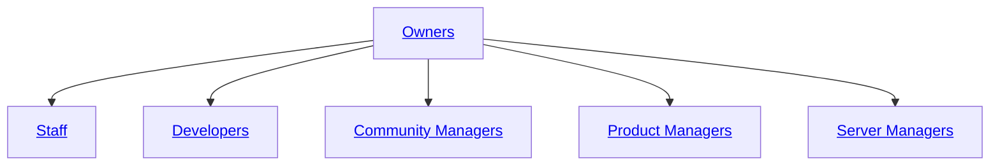

# UDL Organization Chart

```mermaid
graph TD
    A[<a href='./roles/owners.md'>Owners</a>] --> B[<a href='roles/staff.md'>Staff</a>]
    A --> C[<a href='./roles/developers.md'>Developers</a>]
    A --> D[<a href='./roles/community-managers.md'>Community Managers</a>]
    A --> E[<a href='./roles/product-managers.md'>Product Managers</a>]
    A --> F[<a href='./roles/server-managers.md'>Server Managers</a>]
```
