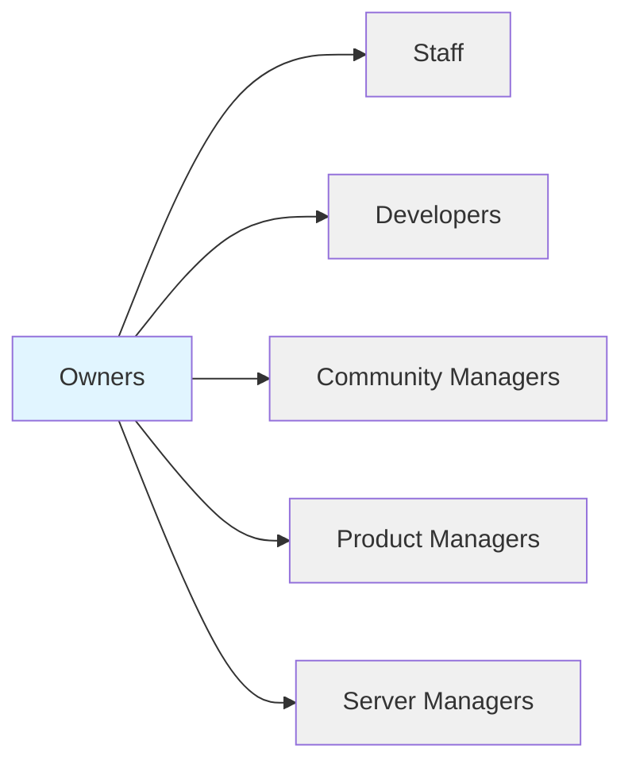

# UDL Organization Chart

## Roles

| Role                                                | Description                                                              |
| --------------------------------------------------- | ------------------------------------------------------------------------ |
| [Owners](./roles/owners.md)                         | Highest level of leadership, responsible for overall strategic direction |
| [Staff](./roles/staff.md)                           | Provide essential support and administrative functions                   |
| [Developers](./roles/developers.md)                 | Build, maintain, and improve technical systems                           |
| [Community Managers](./roles/community-managers.md) | Engage with and grow the community                                       |
| [Product Managers](./roles/product-managers.md)     | Define product strategy and roadmap                                      |
| [Server Managers](./roles/server-managers.md)       | Maintain server infrastructure and performance                           |
