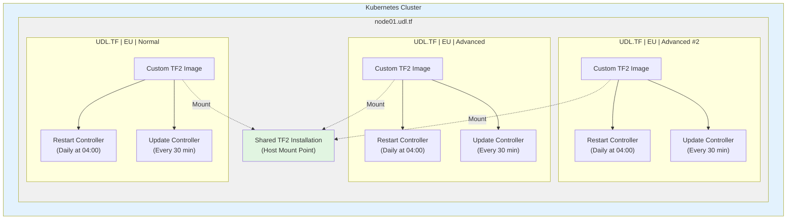

# Infrastructure Overview

## Architecture Diagram

## Components

### Node

- **node01.udl.tf**: Kubernetes dedicated node that hosts all TF2 servers

### Shared Storage

All TF2 servers mount to the same host installation for:

- Storage efficiency (reduced disk usage)
- Faster caching (shared game files)

### Controllers

Each server runs two CronJob controllers:

- **Restart Controller**: Automatically restarts servers daily at 04:00
- **Update Controller**: Checks for game updates every 30 minutes

### Active Servers

- **UDL.TF | EU | Advanced**: Primary advanced gameplay server
- **UDL.TF | EU | Advanced #2**: Secondary advanced gameplay server
- **UDL.TF | EU | Normal**: Standard gameplay server

## Technical Details

- **Platform**: Kubernetes (k8s)
- **Container Images**: Custom TF2 server images
- **Storage**: Host-mounted shared TF2 installation
- **Automation**: CronJob-based restart and update controllers
