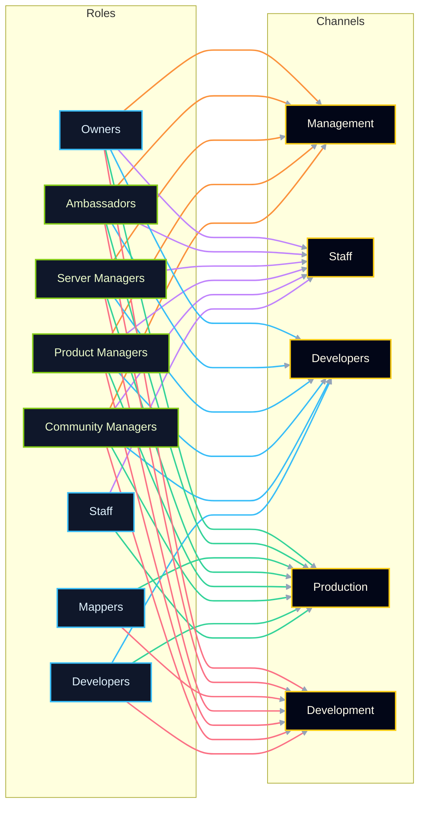

# Communication Channel Permissions

This document establishes a clear permission hierarchy for the organization-wide chat channels so every team member knows where to collaborate. Each channel targets a specific workflow slice while keeping management visibility consistent.

## Management Cohort

The "management" umbrella referenced throughout the channels includes the following roles:

- Owners
- Server Managers
- Community Managers
- Product Managers
- Ambassadors (community-facing leadership role)

> Ambassadors do not yet have a dedicated role page, but they participate in management discussions and should be granted the same channel access as the other management roles.

## Channel Directory

| Channel     | Primary Purpose                                                                                  |
| ----------- | ------------------------------------------------------------------------------------------------ |
| Management  | Strategic coordination space reserved for management cohort members.                             |
| Staff       | Day-to-day operational space that keeps staff aligned with management.                           |
| Developers  | Engineering hub for Developers that still gives management visibility.                           |
| Production  | Cross-functional room for shipping-ready work across Developers, Staff, Mappers, and Management. |
| Development | Iteration space for Developers and Mappers with management oversight.                            |

## Access Matrix

| Channel     | Owners | Staff | Developers | Community Managers | Product Managers | Server Managers | Mappers | Ambassadors |
| ----------- | ------ | ----- | ---------- | ------------------ | ---------------- | --------------- | ------- | ----------- |
| Management  | ✅     |       |            | ✅                 | ✅               | ✅              |         | ✅          |
| Staff       | ✅     | ✅    |            | ✅                 | ✅               | ✅              |         | ✅          |
| Developers  | ✅     |       | ✅         | ✅                 | ✅               | ✅              |         | ✅          |
| Production  | ✅     | ✅    | ✅         | ✅                 | ✅               | ✅              | ✅      | ✅          |
| Development | ✅     |       | ✅         | ✅                 | ✅               | ✅              | ✅      | ✅          |

✅ indicates that members of the role have access to the channel.

## Access Diagram

## Quick Reference Rules

1. Management visibility is guaranteed in every channel listed here.
2. Staff gain access to the Staff and Production channels, aligning them with daily operations and release readiness.
3. Developers collaborate in three rooms: their dedicated channel, Production, and Development.
4. Mappers join Production (for ship-ready work) and Development (for iterative work), ensuring they stay paired with Developers and Management.
5. Ambassadors mirror management access until a formal role document is added.
